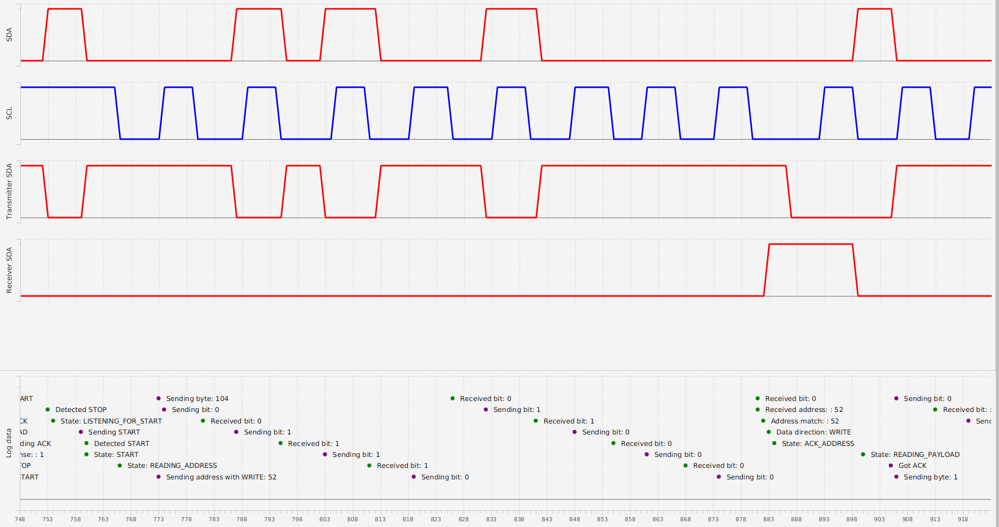

# GenericI2C

A bit-banged implementation of the I2C protocol for receivers and transmitters. Uses basic HAL library to operate microcontroller pins. Doesn't use timers and ISR. </br>
Max speed of 2 bytes per second without logging.</br>
Currently works with 4 GPIO pins per microcontroler (2 for input and output).

## Example
Bi-directional communication of two microcontrollers. (Master - Slave)



Communication sequence:

```
MASTER                                  SLAVE
|                                           |
+-----------[Addres + WRITE]--------------->+
+-----------[Counter]---------------------->+
|                                           |
+-----------[Addres + READ]---------------->+
+<----------[Counter + 1]-------------------+
|                                           |
```

Code snippet:

```C++
HALPin sclOutPin = { .port = &PORTD, .pin = 7, .pullup = PULLUP_DISABLE };
HALPin sdaOutPin = { .port = &PORTD, .pin = 6, .pullup = PULLUP_DISABLE };
HALPin sclInPin = { .port = &PORTD, .pin = 5, .pullup = PULLUP_ENABLE };
HALPin sdaInPin = { .port = &PORTB, .pin = 7, .pullup = PULLUP_ENABLE };

I2C_Config i2c_config = {
    .respondToGeneralCall = true,
    .timeUnit = 100, // 20 -> 2 bytes per second
    .role = MASTER;
    .addr = MASTER_ADDR;
    .loggingLevel = 3};

i2c_config.sclOutPin = sclOutPin;
i2c_config.sdaOutPin = sdaOutPin;
i2c_config.sclInPin = sclInPin;
i2c_config.sdaInPin = sdaInPin;

I2C_init(&i2c_config);

while (1) {
  if(i2c_config.role == SLAVE){
    I2C_read();
    if(I2C_newByteReceived(true)){
      uint8_t payload = I2C_lastByte();
      I2C_logNum("> Got new byte: ", payload, 1);
      I2C_write(++payload);
    }
  }

  if(i2c_config.role == MASTER){
    I2C_sendStartCondition();
    if(I2C_writeAddress(SLAVE_ADDR, WRITE)){
      I2C_write(counter);
      I2C_sendRepeatedStartCondition();
      I2C_writeAddress(SLAVE_ADDR, READ);
      uint8_t response = I2C_receive(true);
      I2C_logNum("> Got response: ", response, 1);
      counter = response;
    } else {
      I2C_logNum("> Address not responding: ", SLAVE_ADDR, 1);
      return 0;
    }
    I2C_sendStopCondition();
  }
}

```